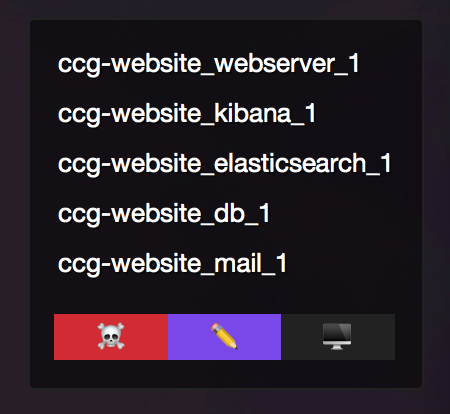

# Übersicht Widgets

A bunch of widgets for [Übersicht](http://tracesof.net/uebersicht/) which make my life easier, use any of them if you want!

These are all customised to my machine (I'm treating this repo as a backup mainly), but easily adjusted to another environment.

## Docker containers & project shortcuts

I generally use this Docker setup for my projects which spins up a serires of containers. This widget shows what is running with shortcuts to Kill them all, edit the project in PHPStorm and SSH into the `webserver` container.

Modified version of [Paulo Gomez's widget](http://tracesof.net/uebersicht-widgets/#ubersicht-docker-containers).

**dockercontainers.widget**

